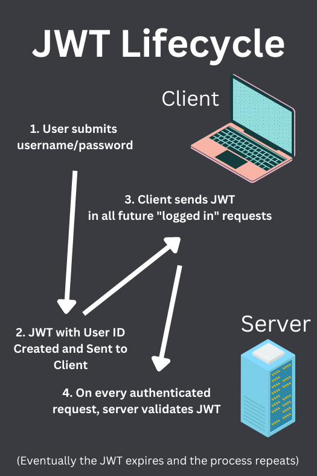

# JWT Jason Web Tokens

JSON Web Tokens are a popular choice for APIs that are consumed by web applications and mobile apps.

A JWT is a cryptographically signed JSON object containing information about a user. Once issued, *the token cannot change without the server knowing*, because the signature would be invalid.

If a token is issued to Bob, Bob can make requests as Bob. He won't be able to change the token to make requests as Alice.

**NOTE**: JWT are *not* encrypted! They are only cryptographically *signed*. Anyone can read what's inside a JWT. You should *never* store sensitive info in a JWT. They are just a way to authenticate a user.

In Go, we'll use `github.com/golang-jwt/jwt/v5` package.

After a user enters a username and password, the server responds with a JWT token that is saved in the client's device. The token remains valid for all subsequent requests until it expires, at which point the user will need to log in again with its username/password.

## Access Tokens

Access JWT are *stateless*: the server does not keep track of them and does not keep track of which users are logged in via JWT. The server just has to sign and validate JWT. Statelessness is fast and scalable because the server does not have to store anything in a DB.

However this pose a problem: *revocability*. If the server doesn't know anything about issued JWT, it cannot revoke them. If a JWT is stolen, the server has no easy way to revoke it. JWT are just cryptographically signed strings of text.

JWT access tokens are:
- Irrevocable
- Stateless
- Short-lived (15m-24h): They must be because they are irrevocable.

The fact that access JWT must be short-lived is a User Experience problem: we don't want the user to have to log in every 15 minutes. To solve this we can use *refresh tokens*.

## Refresh Tokens

Refresh tokens don't provide access to resources directly but instead are used to refresh access tokens.

They are much longer lived and are *revocable* and stateful.

Now the endpoints and servers that provide access to resources use access tokens which are fast, stateless and scalable. And refresh tokens are used to keep users logged in for longer periods of time and can be revoked if a user's access token gets compromised.

Refresh tokens don't need to be JWT at all. In fact, it's probably better to use something else as they'll be stored in a database. No point in using stateless JWT if we store them in a database anyway.
