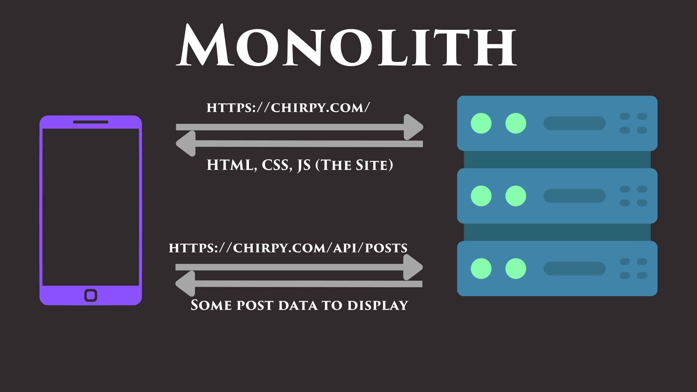
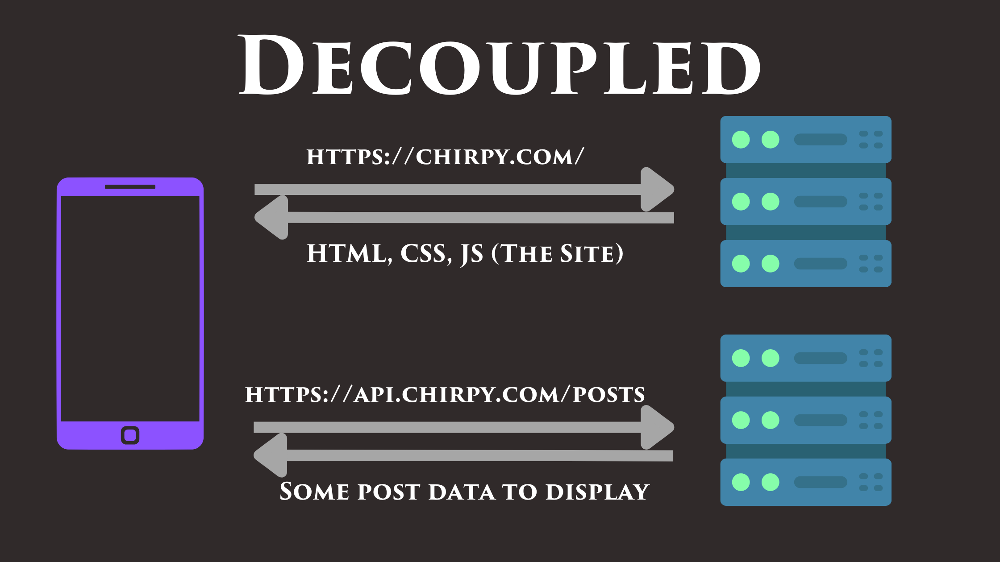

# Docs

## Monolith vs Decoupled Architecture

Monolith is a single large program that contains all the functionality for both front-end and back-end.



Decoupled architecture is one where front-end and back-end are separated in different codebases.



Pros and Cons:
- Monolith
  - Simpler
  - Easier to deploy new version when everything in the app is always in sync
  - Data being embedded in the HTML can lead to better UX
- Decoupled
  - Easier to scale
  - Better separation of concern as codebase grows
  - Site and API can be hosted on separate servers using separate technologies
  - Embedding data in HTML is possible with pre-rendering but more complicated

=> When building a new app from scratch, start with a monolith, but keep front-end and API decoupled logically within the project from the start.

## Deployment Options

### Monolith

Because it's just one program, you just need to get it running on a server exposed to the internet and point the DNS records to it.

Cloud platforms options:
- AWS EC2, GCP Compute Engine, Digital Ocean Droplets, Azure Virtual Machines, Heroku, Google App Engine, Fly.io, AWS Elastic Beanstalk...

### Decoupled

Here there are two different programs that need to be deployed. You could deploy both on the same kind of places, or use a specific platform for the front-end:
- Vercel, Netlify, Github pages...

## RESTful API

REST is a set of guidelines for building APIs.

It's conventional to name the endpoints after the resource they represent. The name are usualy to be plural, e.g. `POST /api/chirps` to create a new "chirp".

To get multiple chirps at once, we'd use the endpoint `GET /api/chirps`.

To get a *singleton*, or a single instance of a resource, the convention is to use a `GET` request to the plural name of the resource, the same endpoint we use for getting all chirps, but to use an ID as a *path parameter*, i.e. `GET /api/chirps/<uuid>`.

## Authentication

Verifying *who* a user is. Some of the schemes used:
- Passwords + ID (username, email, ...)
- 3rd party (Google, Github, ...)
- Magic Links
- API Keys

E.g. for a CLI app, it would make the most sense to use an API key.

### Authentication with passwords

Two important points when authenticating with passwords:
- Password must be stored *hashed*. **Never store passwords in plain text!**
- You must validate user's passwords to make sure they are *strong*. The best measure of password strength is the *length* of the password. A good validation scheme should allow any special character, capitals and symbols in the password. But the *length* is the most important characteristic.

Hashing prevents passwords from being read if (or *when*) someone gets access to the db. We'll use `bcrypt` package to hash passwords and compare passwords hashes. Any good and strong key derivation function will do.

As long as the server uses HTTPS in prod, it's OK to send raw passwords in requests, because they'll be encrypted.

### JWT

See [Json Web Tokens doc](./JWT.md).

## Testing with Curl

Deleting *all* users (only in "dev" mode)
```shell
curl -X POST -L -i localhost:8080/admin/reset
```

Creating a user:
```shell
curl -X POST -L -H -i "Content-Type:application/json" -d '{"email":"toto@pafcorp.net","password":"123456"}' localhost:8080/api/users
```

Login a user:
```shell
curl -X POST -L -i -H "Content-Type: application/json" -d '{"email":"paf@pafcorp.net","password":"123456"}' localhost:8080/api/login
```

Creating a chirp, with the `user_id` of a previously created user:
```shell
curl -X POST -L -i -H "Content-Type: application/json" -d '{"body":"Hello! My first chirp!","user_id":"cb4d8b86-9491-4b95-bc17-283ca7e83ddb"}' localhost:8080/api/chirps
```
